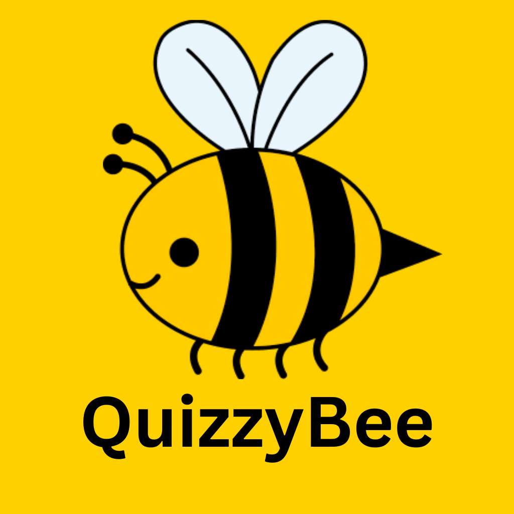

# Welcome to QuizzyBee

We are so happy to welcome you to QuizzyBee. If you do not have time to read the below please see the follow video which includes: Team Introductions, Brief App Description, and an App Demo! https://youtu.be/qDWL-hlDum4

## Team Credits
The following people contributed to the QuizzyBee project:

> Griffin Newbold 

> Madeleine Lerner 

> Yuxin Li

> Thomas Lam

> Chia Peng Wu

## Where to Find More Information
The Project Proposal is located here: <a href="https://gitlab.com/mobileappdevelopmentios/w4995_fall24/teams/vulture/-/wikis/Project-Proposal">Proposal: Wiki</a> We also held Developer Syncs which can be viewed here: <a href="https://gitlab.com/mobileappdevelopmentios/w4995_fall24/teams/vulture/-/wikis/Developer-Sync">Developer Sync</a> Finally we performed a very high level backend overview along with created figma designs for our UI which can be found here: <a href="https://gitlab.com/mobileappdevelopmentios/w4995_fall24/teams/vulture/-/wikis/Basic-Architecture-and-Design"> Architecture + Figma </a> 

## Lasting Technical Debt
We worked very hard to ensure that there are no errors (there aren't as the app builds just fine) and we also worked hard to ensure XCode didn't generate any warnings, we managed to remove all but 1 warning which is simply warning of a deprecated feature, when we followed the suggestions of XCode to remove the warning, we received logic errors with regard to our navigation so we felt it was best to leave this single warning in so we may avoid these errors for now. If we had more time to continue development we would certainly ensure this warning would be fixed and removed while maintaining proper functionality of the app.

# Thank you for Stopping By :^) Have a Great Day!! Happy Holidays